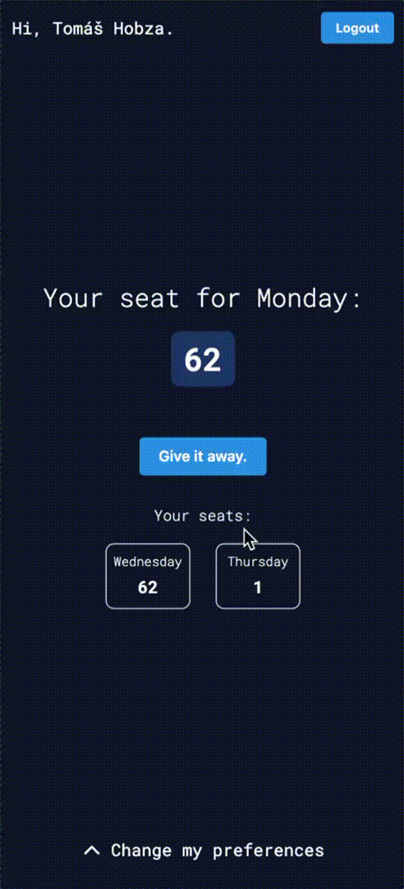

# FNZ Seat Booking app

A simple app created using SvelteKit and Firebase for booking seats in the FNZ Brno office (L5). It's nothing huge, but it aims to solve the confusion caused by the current system (Excel spreadsheet).

## How does it work?

Login is done throught google auth. It's the safest and fastest to implement, although I'd love to implement our company's microsoft auth.

A user selects their preferred seat for each day of the week. For each day, they have 3 choices going down from the most preferred. On every sunday a cloud function runs that calculated the seat assignments for the upcoming week.

The user can see their seat for today in the app as well as the assigned seats.

In case the user want's to come to the office, but didn't set a preferrence before the calculation, they can take empty seats for just that day (if there are any).

On the other hand, if the user decides not to come to the office, they can give the seat away - again just for that day - and it will appear as empty to other users.

## Demos

Choosing an empty seat:

Setting preferrences:

## Transparency

The app doesn't save any informations about the user. It just assigns each of them a token on login and then uses only that token. A user can only read their preferrence.
